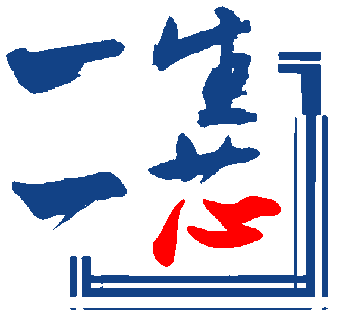

## Hi there 👋
<!--
**VectorFruit/VectorFruit** is a ✨ _special_ ✨ repository because its `README.md` (this file) appears on your GitHub profile.

Here are some ideas to get you started:

- 🌱 I’m currently learning at TYUT
-->

I'm @VectorFruit, an undergraduate student at the College of Mineral Engineering, Taiyuan University of Technology.

Although my major is not in computer science or electrical engineering, I have a strong interest in both fields, particularly in computer architecture and digital design. I'm currently studying the full-chip design flow, with a focus on RISC-V and open-source hardware development.

I also serve as a teaching assistant in the One Student One Chip (一生一芯) program, where I assist participants in understanding processor microarchitecture, hardware description languages (HDLs), and simulation/debugging tools such as Verilog and QEMU.

I aspire to become a computer systems engineer and am actively building the skills required for that goal.

Working with

    
    
    
    

Learning

    
    
    

Interested in

    

> "The sky is the limit."  
> "天空即为极限。"

  
  

